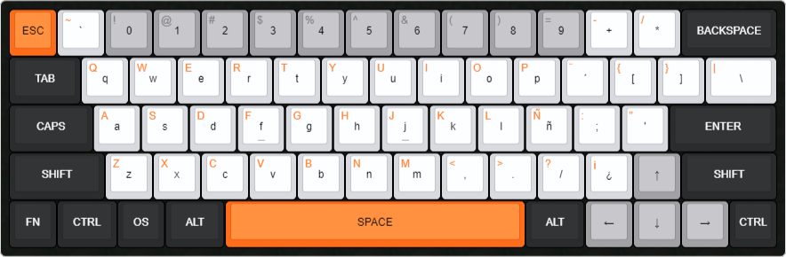

# Orange Moon Keyboard

This is a custom keyboard for the streamer [blodiemoon](https://www.twitch.tv/blodiemoon).

## Design

## Legends

## Plate Layout

## How to use

The keyboard has its own custom commands. To use them, you need to press the `Fn + Win` + the key you want to use.

## List of commands

- `Fn + Win + O`: Open the Orange Moon UI Panel.

## External links

- [Twitch](https://www.twitch.tv/blodiemoon)
- [Keyboard Editable Preset](http://www.keyboard-layout-editor.com/#/gists/af4cfa8196742579c82e6b50de0093ab)
- [Auto Hotkey](https://www.autohotkey.com/)
