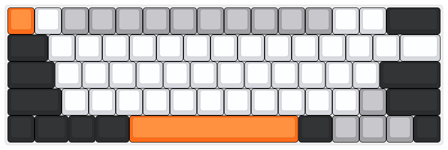

# Orange Moon Keyboard

This is a custom keyboard for the streamer [blodiemoon](https://www.twitch.tv/blodiemoon).

## How to use

The keyboard has its own custom commands. To use them, you need to press the `Fn + Win` + the key you want to use.

## List of commands

- `Fn + Win + O`: Open the Orange Moon UI Panel.

## External links

- [Twitch](https://www.twitch.tv/blodiemoon)
- [Keyboard Editable Preset](http://www.keyboard-layout-editor.com/##@_name=Orange%20Moon&author=blodiemoon&background_name=PBT%20Black&style=background-image%2F:%20url('%2F%2Fbg%2F%2Fplastic%2F%2Fpbt-black.png')%2F%3B&$$hashKey=08S%3B&switchMount=cherry&switchBrand=cherry&switchType=MX1A-E1xx&pcb:true%3B&@_c=%23ff6d1a&a:7%3B&=&_c=%23d9dae0%3B&=&_c=%23a2a2a6%3B&=&=&=&=&=&=&=&=&=&=&_c=%23d9dae0%3B&=&=&_c=%232b2c2e&w:2%3B&=%3B&@_w:1.5%3B&=&_c=%23d9dae0%3B&=&=&=&=&=&=&=&=&=&=&=&=&=&_w:1.5%3B&=%3B&@_c=%232b2c2e&w:1.75%3B&=&_c=%23d9dae0%3B&=&=&=&_n:true%3B&=&=&=&_n:true%3B&=&=&=&=&=&=&_c=%232b2c2e&w:2.25%3B&=%3B&@_w:2%3B&=&_c=%23d9dae0%3B&=&=&=&=&=&=&=&=&=&=&=&_c=%23a2a2a6%3B&=&_c=%232b2c2e&w:2%3B&=%3B&@=&_w:1.25%3B&=&=&_w:1.25%3B&=&_c=%23ff6d1a&w:6.25%3B&=&_c=%232b2c2e&w:1.25%3B&=&_c=%23a2a2a6%3B&=&=&=&_c=%232b2c2e%3B&=)
- [Auto Hotkey](https://www.autohotkey.com/)
